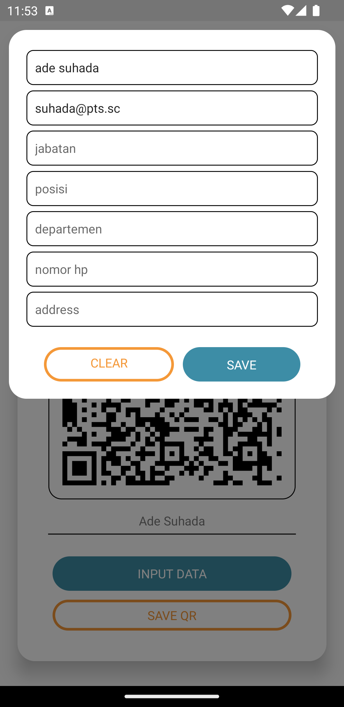

# React Native QR Generator App

---
<div align="center">
   
  
</div>

---
feel free to use this open app to generate profile qr-code.

## Command
```bash
# install
npm i

# run for android
npm run adnroid

# run for ios
cd ios && pod install
cd ../ && npm run ios
```

## Reference
- [qr code main lib](https://github.com/awesomejerry/react-native-qrcode-svg#readme)